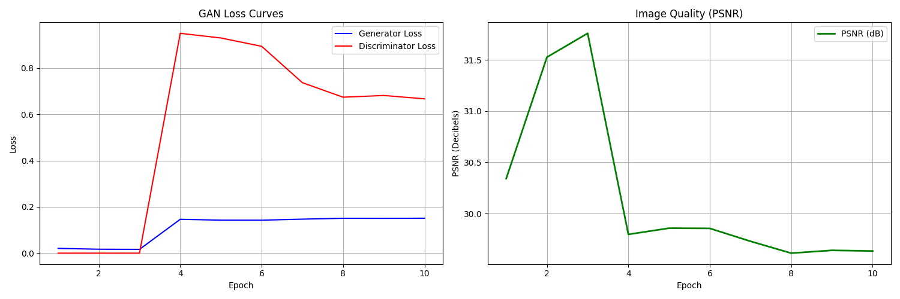
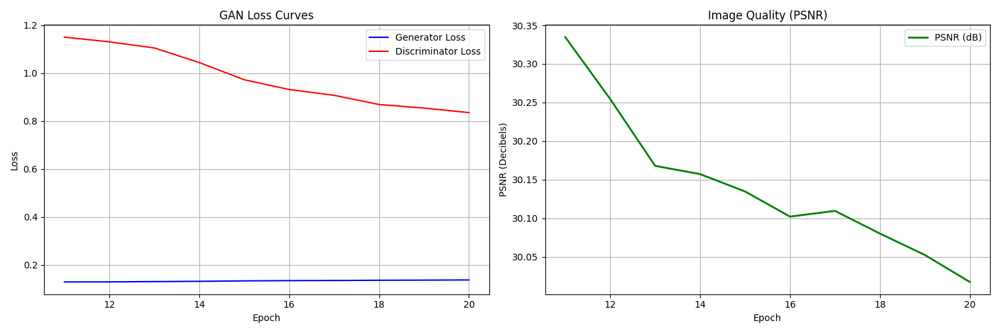
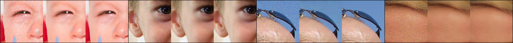
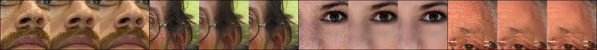
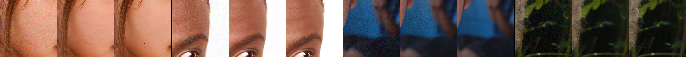
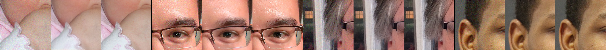

# 4x Face Super-Resolution using RRDBNet


PyTorch implementation of **4× facial image super-resolution** using the **RRDBNet architecture** with perceptual and adversarial training inspired by ESRGAN.

The model is trained on **FFHQ high-resolution face images** and evaluated on **CelebA** to reconstruct high-resolution facial images from low-resolution inputs.

---

## Project Overview

Super-resolution aims to reconstruct a **high-resolution (HR) image from a low-resolution (LR) input**.

This project implements a **GAN-based super-resolution pipeline** consisting of:

- **RRDBNet Generator**
- **CNN Discriminator**
- **VGG Perceptual Loss**
- **Adversarial Training**

The model upsamples **64×64 images to 256×256 (4× scale)**.

---

## Architecture

The generator is based on **Residual-in-Residual Dense Blocks (RRDB)**.

### Key Components

Generator
- RRDBNet architecture
- Dense residual blocks
- PixelShuffle upsampling

Discriminator
- CNN-based discriminator
- Patch-based prediction

Loss Functions
- L1 Pixel Loss
- VGG19 Perceptual Loss
- Adversarial BCE Loss

---

## Training Pipeline

Training was performed in **two stages**:

### Run 1
- Epochs: **1 → 10**
- Includes **warmup training** for generator stability
- Generator trained initially using **pixel loss**

### Run 2
- Epochs: **11 → 20**
- Training resumed using saved weights
- Full **GAN training enabled**

---

## Datasets

### Training Dataset
**FFHQ (Flickr-Faces-HQ)**  
High-quality human face images used for training the model.
**Link:** [click here](https://www.kaggle.com/datasets/rahulbhalley/ffhq-1024x1024)


### Evaluation Dataset
**CelebA (CelebFaces Attributes Dataset)**  
Used to test generalization performance on unseen face images.
**Link:** [click here](https://www.kaggle.com/datasets/thang1703/celebahq-1024x1024)

---

## Training Results

### Run 1 Training Graphs (Epoch 1–10)

Generator and Discriminator loss curves with PSNR.



---

### Run 2 Training Graphs (Epoch 11–20)

Training resumed from saved checkpoint.



---

## Sample Super-Resolution Outputs

Example results showing:

```

Low Resolution | Generated Super Resolution | Ground Truth

```

### Epoch 5 Results



### Epoch 10 Results



### Epoch 15 Results



### Epoch 20 Results



## Testing Results

Testing results are available at: [Here](https://www.kaggle.com/datasets/fe59c3c43628b3f2ad5126907ee214577cc8397625801cd86328133b8d1a6a00/)
